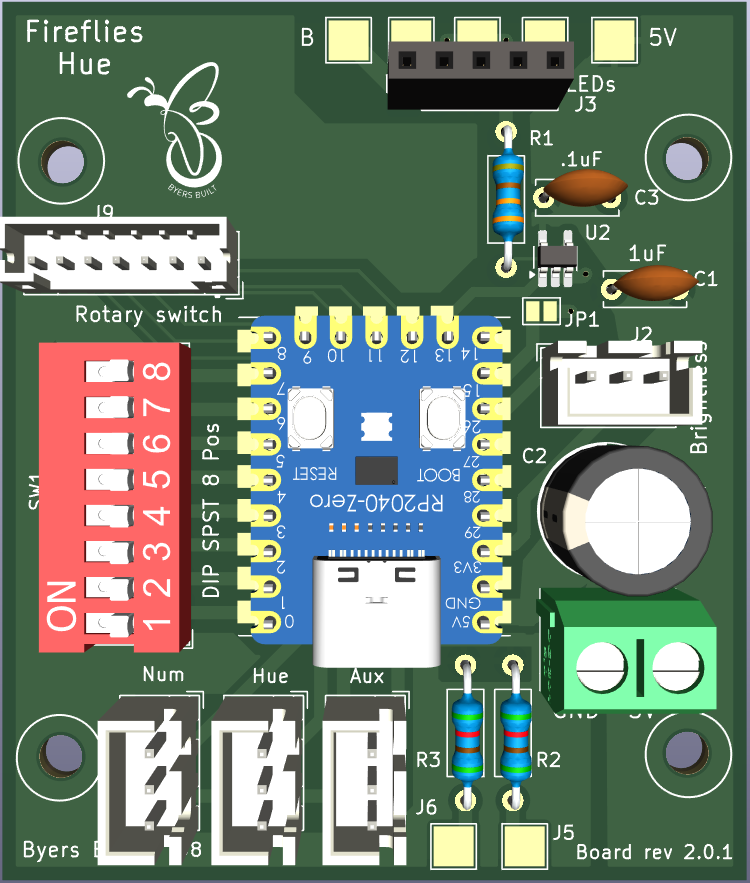

# The Fireflies LED Controller Project

This project delivers both hardware and firmware for turning an addressable LED string into simulated fireflies

<video src="C:\git\fireflies_project\assets\IMG_0222.MOV"></video>

## What the Fireflies LED Controller can do
* Turns an LED string into simulated fireflies
* Select from 8 color effect choices with a turn of a knob
* Allows you to dim for more realistic fireflies. Or select full brightness to use for holiday lights.
* Supports two different builds
  * A simple two knob build for a simple interface
  * A five knob build that allows you to select any hue, the number of concurrent fireflies, and the percentage mix of colors

* Works with any WS2812 LED string

### The Hardware

* New compact implementation fits in a 4 x 2.75 x 2 inch project box
* Supports 10m of wire 
* Support up to 100m of wire between the controller and the first LED with optional RS485 daughter board
* Incorporates a Waveshare RP2040 Zero microcontroller module
* Uses a fast surface mount XOR gate to boost to the [5V 800 kHz signal](./assets/800kHz_original_and level shifted_double_1_5.png) required by the LEDs
* Custom circuit board design with full ground plane and top copper pour.  Utilizes all top side exposed RP2040 Zero pins
  * Kicad PCB design files available

</img>

### The Firmware

* Arduino C++

* Reads a DIP switch and configures for

  * 50, 100, 150, or 200 LED strings

  * Any color order (RGB, BGR, etc.)

  * Alternate color to warm white

* Reads the rotary knob to determine the of color affect

  * Yellow fireflies

  * All hues, slowly shifting.

  * Warm white

  * 85% Orange, 15% Purple (Halloween)

  * 85% Blue, 15% Green

  * 85% Green, 15% Blue

  * 85% Green, 15% Red

  * Blue through Green palette, slowly shifting

### How this project started

This project started in Fall of 2022 when I was playing around with led strings to create outdoor Christmas lights.  A few months later I was reminiscing about seeing "lightning bugs" every summer while I was growing up.  The idea gelled to simulate the fireflies those fireflies so I could enjoy the effect any time of year.  

My first prototype employed a Arduino Nano as the microcontroller.  It was able to support five simultaneous LEDs.  And I used three knobs for RGB values so I could experiment with color choices.

I got a boost in the Fall of 2023 with a visit from a family member from the US Midwest who has fireflies every year in her yard.  That allowed me to tune the color and duration to the fireflies I grew up with.  

Soon after that I decided to change to a faster microcontroller.  And I found much more appropriate LED strings rather than the clunky plastic covered LED strips I had be working with.

That resulted in my first prototype on protoboard.  It used a Pi Pico RP2040 microcontroller board that is still in use outdoors!  The journey continued with a v1 circuit board implementation in a smaller box.  That led to the current V2 version with additional features.   

**[Hardware Revision History with images][./hardware_revision_history.md]**

