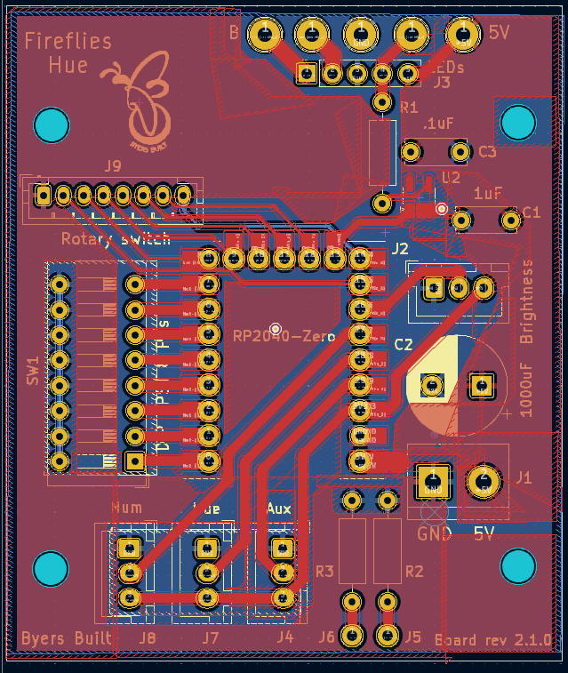
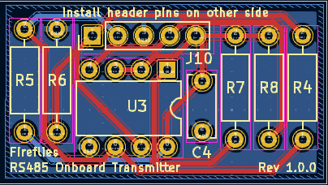

#  The Fireflies LED Controller Project

This project delivers both hardware and firmware for turning an addressable LED string into simulated fireflies

Click image for video

## What the Fireflies LED Controller can do
* Turns an LED string into simulated fireflies
* Selects between eight color effects with a turn of a knob
* Allows you to dim for realistic fireflies. Or select full brightness to use for holiday lights.
* Supports two different builds from same circuit board
  * A two knob build for a simple interface and easier build
  * A five knob build that allows you to select any hue, the number of concurrent fireflies, and the percentage mix of colors

### User guides

* [V1 Fireflies LED Controllers](https://github.com/JamesByers/fireflies_led_controllers/blob/main/README.md)
* V2 Fireflies Hue (guide under development)

</img>

### The Hardware

* Compact implementation fits in a 4 x 2.75 x 2 inch project box
* Optional RS485 daughter board supports up to 50m of wire between the controller and the first LED. 10m of wire is supported with no daughter board
* Incorporates a Waveshare RP2040 Zero microcontroller
* Uses a fast surface mount XOR gate to level shift to the [800kHz signal](./assets/800kHz_original_and_level_shifted_double_1_5.png) to the 5V required by the LEDs
* Custom circuit board design with full ground plane and top copper pour.  Utilizes all top RP2040 Zero pins
  * [Schematic](./assets/Fireflies_2_0_1_schematic.pdf) (PDF)
  * Designed in Kicad.  [Gerber fabrication files](./hardware_files/Gerber/)
  * PCB dimensions: 56mm x 66mm (2.2 x 2.6 inch)

<table>files
  <tr>
    <td>
    	

            

	</td>
    <td>
        

            

    </td>
  </tr> 
</table>

#### Optional RS485 daughter board

[Schematic](./assets/Fireflies_v2_rs485_daughter_board_schematic.pdf)

<table>
  <tr>
    <td>
    	

            

	</td>
    <td>
        

            

    </td>
  </tr> 
</table>

### The Firmware

*  [Sample code](./code/Firefly_and_rainbow_rpzero_dimmer_brd_2_0_1/Firefly_and_rainbow_rpzero_dimmer_brd_2_0_1.ino). Written in Arduino C++
*  Schedules new fireflies
*  Controls rising and falling brightness of each firefly
*  Turns on the last LED for 2 seconds at startup to verify the string is working
* Reads the DIP switch and configures for
  * 50, 100, 150, or 200 LED strings
  * Any color order (RGB, BGR, etc.)
  * Select alternate color
* Reads the rotary knob to determine which one of the eight color affects to apply
   1.  Yellow fireflies
   2.  All hues, slowly shifting.
   3.  Warm white
   4.  85% Orange, 15% Purple (Halloween)
   5.  85% Blue, 15% Green
   6.  85% Green, 15% Blue
   7.  85% Green, 15% Red
   8.  Blue through Green palette, slowly shifting
* Works with any WS2812 LED string

### How this project started
This project started in Fall of 2022 when I was playing around with led strings to create outdoor Christmas lights.  A few months later I was reminiscing about seeing "lightning bugs" every summer while I was growing up.  The idea gelled to simulate the fireflies those fireflies so I could enjoy the effect any time of year.  

My first prototype employed a Arduino Nano as the microcontroller.  It was able to support five simultaneous LEDs.  And I used three knobs for RGB values so I could experiment with color choices.

I got a boost in the Fall of 2023 with a visit from a family member from the US Midwest who has fireflies every year in her yard.  That allowed me to tune the color and duration to the fireflies I grew up with.  

Soon after that I decided to change to a faster microcontroller.  And I found much more appropriate LED strings rather than the clunky plastic covered LED strips I had be working with.

That resulted in my first prototype on protoboard.  It used a Pi Pico RP2040 microcontroller board and is still doing its thing everyday outdoors!  The journey continued with a v1 printed circuit board implementation in the smaller box.  That led to the current V2 version with additional features.   

**[Hardware Revision History with images](hardware_version_history.md)**

            

