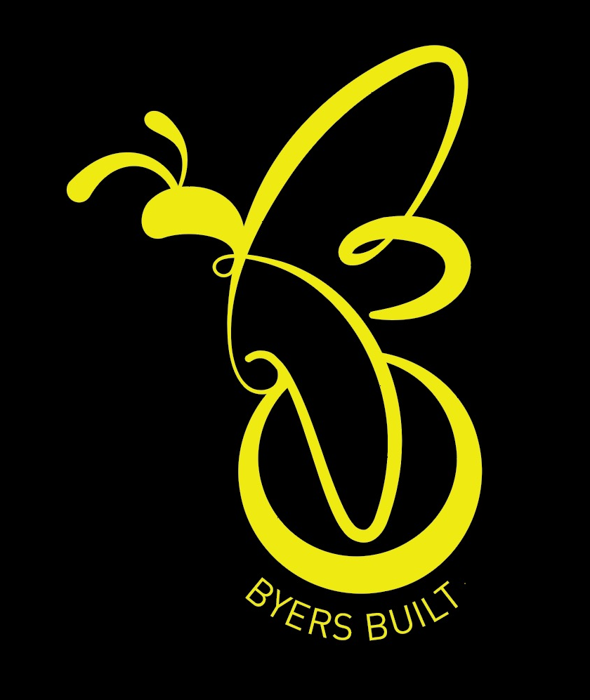
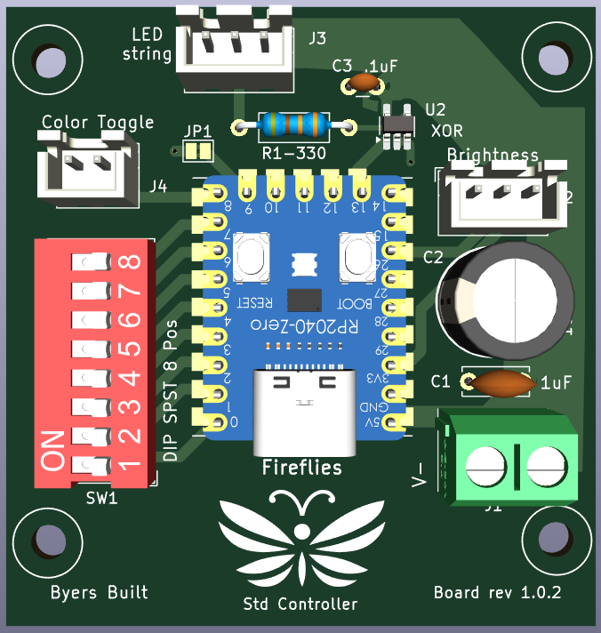
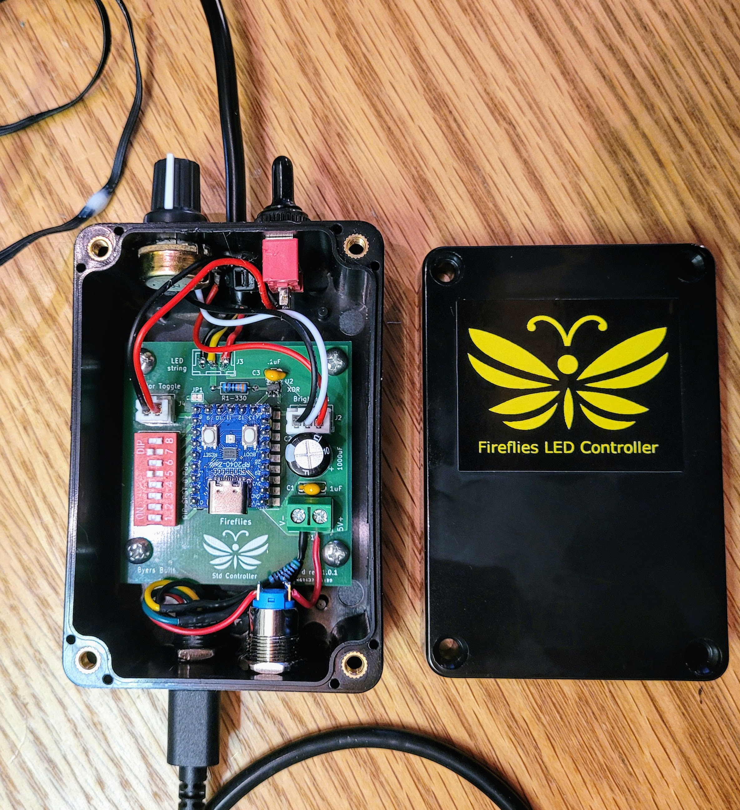

#  The Fireflies Project

## Hardware version history

This page provides information about each revision of the V1 (original) and V2 (FIreflies Hue) hardware implementations.

### V2 Hardware (Fireflies Hue)

**V2**, also known as Fireflies Hue adds the ability to read addition inputs.  An eight position rotary switch replaces the v1 toggle switch. Three potentiometers are added to control Hue, number of concurrent fireflies, and percent mix of two colors.

**Board v2.1.0**

* Upgraded rotary switch support to eight selections instead of seven.
* Removed jumper used to force default settings, freeing up a pin for the rotary switch.
* Added a top copper pour to reduce environmental impact of circuit board manufacture.
* Added support for 5k1 Ohm resistors on board for quicker build for forcing 3A USB-C current level.
* Positioned the small caps much closer to the XOR gate.
* Changes input and output pads to through hole for better mechanical strength,

**Board v2.0.1**

- Replaced toggle switch with rotary switch.
- Added support for three additional potentiometers.
- Added support for a RS485 daughter board to support long distances to the first LED.  Designed to handle distances of up to 100m.
- Added new custom Firefly Hue logo.

### V1 Hardware - The original Fireflies LED Controller!
<table>
  <tr>
    <td>
    	
	</td>
    <td>
    	
    </td>
  </tr> 
</table>

* **Board v1.0.2**
  * Final V1 board design
  * Improved the layout for more effective ground plane and power distribution
* **Board v1.0.1**
  * Added a ground plane to the PCB.
  * Added .1uF capacitor for better power management for XOR gate.
* **Board v1.0.0**
  * New compact implementation fits in a common [100X68X50mm project box](https://www.amazon.com/gp/product/B07RTYYHK7).
  * First PCB design (Printed Circuit Board)
  * Changed to a RP2024 Zero microcontroller from a Pi Pico
  * Replaced previous level shifter with an high speed XOR gate to shift the high speed signal from 3.3V to 5V.
  * Added a DIP switch to select between:
    * RGB Color order to assure the LED controller is compatible with all WS2812 RGB strings.
    * LED string lengths of 50, 100, 150, and 200 LED strings
    * Select alternate colors

### Pi Pico RP2040 original prototype

It worked!

I learned from the prototype that the 3.3V-5V level shifter was actually *reducing the voltage* of the 800 kHz communication to the LEDs.  Yikes!

